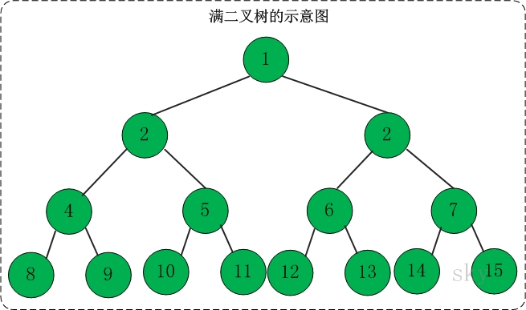

### 二叉树的性质
性质1 :二叉树第i层上的节点数目最多为2^(i-1) (i>=1);
性质2 :深度为k的二叉树至多有2^(k)-1;  
性质3: 具有n个节点的完全二叉树的深度必为log2(n) + 1 
性质4: 在任意一颗二叉树中，若终端结点的个数为n0,度为2的节点数为n2,则 n0 = n2 + 1;

性质5：下标为i的双亲，其左孩子的下标必是2i,右孩子的下标必为2i+1

### **满二叉树** 

高度为h,并且由2^(h) -1 个节点组成的二叉树，被称为满二叉树。

### 完全二叉树

**定义**：一棵二叉树中，只有最下面两层结点的度可以小于2，并且最下一层的叶结点集中在靠左的若干位置上。这样的二叉树称为完全二叉树。

 **特点**：叶子结点只能出现在最下层和次下层，且最下层的叶子结点集中在树的左部。显然，一棵满二叉树必定是一棵完全二叉树，而完全二叉树未必是满二叉树。 

### 二叉查找树

**定义**：二叉查找树(Binary Search Tree)，又被称为二叉搜索树。设x为二叉查找树中的一个结点，x节点包含关键字key，节点x的key值记为key[x]。如果y是x的左子树中的一个结点，则key[y] <= key[x]；如果y是x的右子树的一个结点，则key[y] >= key[x] 

在二叉查找树中： 

(01) 若任意节点的左子树不空，则左子树上所有结点的值均小于它的根结点的值；

(02) 任意节点的右子树不空，则右子树上所有结点的值均大于它的根结点的值； 

(03) 任意节点的左、右子树也分别为二叉查找树。 

(04) 没有键值相等的节点（no duplicate nodes）。 

### 二叉树的存储结构

一，顺序存储结构

按二叉树的节点**“自上而下，从左至右**”编号，用一组连续的存储单元存储。

 二叉树的顺序存储结构中节点的存放次序是：对该树中每个节点进行编号，其编号从小到大的顺序就是节点存放在连续存储单元的先后次序。 

 若把二叉树存储到一维数组中,则该编号就是下标值加1（注意C/C++语言中数组的起始下标为0）。 

**树中各节点的编号与等高度的完全二叉树中对应位置上节点的编号相同** 

定义为：typedef ElemType SqBTree[MaxSize]; 

字符串：SqBTree bt="#ABD#C#E######F"; 

### 二叉树的链式存储

