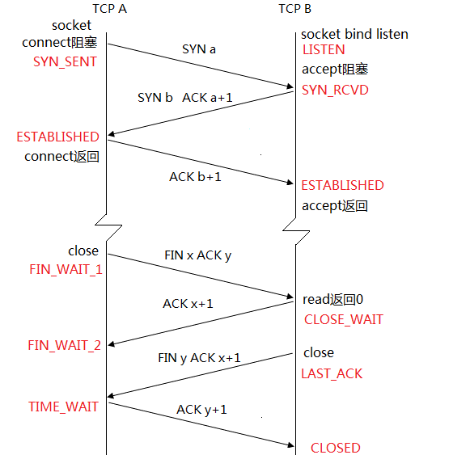

### socket 基本概念
socket 可以看成是用户进程与内核网络协议栈的编程接口
### ipv4 国际套接字接口
 ~~~
 	struct  socketaddr_in{
		uint8_t sin_len; // 4 字节
		sa_familt_t sin_family;// 4字节
		in_port sin_port;// 2字节
		struct in_addr_sin_addr;//4字节
		char size_zero[8];//8 字节
	}
 ~~~
1, sin_len 有的协议里面没有了。man 7 ip查看就没有 
2, sin_family 指定该地址家族，这里必须设定为AF_INET;
3,sin_port 是端口
4,size_zero 暂不使用，一半将其设置为0
### 通用地址结构 一般很少用，用上面的强转
 ~~~
 	struct sockaddr{
		uint8_t sin_len;
		sa_family_t sin_family;
		char sa_data[14] // 这里的14 等于上面的sin_port ，sin_addr,sin_zero	加起来
	}
 ~~~
 1, sin_len 整个结构体长度
 2, sin_family 指定该地址家族
 3, sa_data 由sin_family 决定它的形式

 以上两个结构是通用的。
### socketaddr_in 和 sockaddr 是通用的。

### 网络字节
 1，字节序 
  大端字节序，和 小端字节序 。不同的主机有不同的字节序，x86 为小端，motorola大端
  arm 字节序是可配置的。
 2,网络字节序 规定为大端字节序。

### 字节序转换函数
 uint32 htonl(uint32_t hostlong);
 uint16_t hons(uint16_t hostshort);
 uint32_t ntohl(uint32_t netlogn);
 uint16_t ntohs(uint16_t netshort);
 上述函数中，h代表host  n代表network  s代表shot l代表logn; man 2 htonl;
	
### 地址转换函数

1,在tcp/ip 协议里，iPv4 是32bit. === > 192.168.6.222 怎么把  它 转换成32 位数？
int inet_aton(const char * cp ,struct in_adr * inp)		
in_addr_t inet_addr(const char * cp);
char * inet_ntoa(struct in_adrr_in);

### 套接字类型
1,流式套接字（SOCK_SREAM）
提供面向连接的，可靠的数据传输服务，数据无差错，无重复的发送，且按照顺序接受
2，数据报式套接字（SOCK_DGRAM）
提供五连接服务。不提供无措保证，数据可能丢失，或重复，并且接受顺序混乱
3,原始套接字（SOCK_RAW）
### listen  
1，一般来说，listen 函数应该在socket和bind 之后，调用函数accept 之前调用。
2,对于给定的监听套接口，内核要维护两个队列。
	1),已由客户发出并到达服务器，服务器正在等待完成相应的tcp 三路握手过程。
	2),已完成连接队列。
	3) ，这连个队列的和不超过backlog.
### TCP连接创建过程
1,服务器收到客户端SYN包,发送SYN+ACK包后,在内存创建一个状态为SYN_RCVD
 的连接,放入未完成队列,这个队列的大小可通过/proc/sys/net/ipv4/tcp_max_syn_backlog设置.
2,服务器收到客户端的ACK包后,该连接的状态由SYN_RCVD改为ESTABLISHED,并移到已完成队列.
服务器程序调用accept后,该连接移除已完成队列, 由内核交给程序控制
### accept 函数
 功能：从已完成连接队列中返回第一个连接，如果已完成连接队列为空，则阻塞。
### 命令：netstat -na | grep 8001 netstat -na | grep tcp
### 实验 
1,启动服务器，启动客户端。
2，在服务器中ctrl+c 再重启，会起不来。（客户端不关）这个时候需要地址复用。
### socket api 中的地址复用。
1,服务器端尽可能使用SO_REUSEADDR
2,在绑定之前尽可能调用setsockopt 来设置 SO_REUSEADDR 套接字选项。
3,使用SO_REUSEADDR 选项可以使得不必等待TIME_WAIT 状态消失就可重连服务器。
### 长连接&&短连接
1，服务器端一般不会主动close,客户端
2, 客户端每做一次通信，就断掉。
### tcp 协议是流模式的 无边界
1,流模式是无边界。这就可能导致服务器接受报文的时候，接受不完整导致的。只维护发送出去多少
，确认了多少，没有维护消息与消息之间的边界，因而可能导致粘包的问题。
2, udp 消息 数据报 有边界。
3, 对等方，一次读操作，不能保证完全把消息对完。对方接受数据包的个数不确定的。
### 粘包 粘包产生的原因
1,SQ_SNDBUG 套接字本身有缓冲区（发送缓冲区，接受缓冲区）
2,tcp传送端mss 大小限制。
3,链路层也有MTU大小限制，如果数据包大于>MTU 要在ip层进行分片，导致消息分割。
4,tcp 的流量控制和拥塞控制，也可能导致粘包。
5,tcp 延迟发送机制，等等。
结论：tcp/ip 协议，在传输层没有处理粘包的问题。
### 粘包解决方案
1,本质上是要在应用层维护消息与消息的边界。
		定长包，
		包尾加\r\n(ftp)
		包头加上包体长度
		更复杂的应用协议
### 包头加上包体长度编程 查看demo
	发报文的时候，前四个字节长度（转成网络字节）+包体   
	收报文的时候，先读四个字节，求出长度，根据长度读数据。
### 包尾加上\n 编程实战
	size_t  recv(int s , void * buf ,size_t len,int flags);
1,与read 相比，只能用于套接字文件描述符。 专门为socket 开发的。
2,多了一个flags 
MSG_OOB 带外数据，紧急指针。 暂不研究
MSG_PEEK (数据包的提前预读)
1, 可以读数据，不从缓冲区中读走，利用此特点可以方便实现按行读取数据。
   一个一个字节的读，方法不好，多次调用系统用read方法。
2 recv 函数会将套接字缓冲区中的内容读出，但不清空，与read
   函数的区别在此，此函数有一个flag 标志位，MSG_PEEK
### 服务器端处理多进程常见问题
1 ，比如5个进程同时死掉，会同时向老爹发送SIGCHLD ，
5个子进程基本上是并发死亡，但是sigchild 是不可靠信号。。 
  ~~~
    void handler_sigchild(int si)
   {
	   int mypid = 0;
	   while((mypid = waitpid(-1,NULL,WNOHANG))>0){
		   printf("退出。。");
	   }
   }
  ~~~

### tcp/ip 的11种状态

1 ，3次握手的时间是非常快的，基本上YSN_SEND SYN_RCVD 是基本看不到的。

服务器端调用了listen 函数，那么这个套节字 listen(listenfd,SOMAXCONN) listen 将进入被动套接字。只来做监听操作。而主动套接字可以主动的发送连接。

2，ccp/ip 为什么要做3次握手，4次断开？ 

三次握手：tcp/ip 是全双工 双通道协议。2次身份认证。确定身份。

四次断开：不管是客户端还是服务端都可以主动关闭连接。先调用close 的一端，最终socket 推进到**TIME_WAIT** 状态。TIME_WAIT 的言外之意是等一会再close.

进入TIME_WAIT 之后，再重新绑定失败，就需要setsockopt(listenSQL_SOCKET,S_REUSEADDR,&on,sizeof(on)
		
服务器和客户端都要显示的close. 客户端close 了，不代表服务端不能写数据。

FIN_WAIT_2 是典型的半连接状态。客户端主动的关闭close.对等方read

,这个时候tcp/ip协议瞒着上层应用，偷偷的发送确认数据段，这个时候客户端往前推进，推进到FIN_WAIT_2状态。

为什么会出现半连接状态？socket 状态就停止在这里不往前推进呢？

因为对等方没有显示的调用close 函数。

3，为什么tcp/ip协议设计成 主动关闭socket 的一端进入TIME_WAIT 而不是直接close ?
因为要给对等方
来个确认，但是在公网上这个确认不是那么顺利，网络拥赛，或者是异常处理，这个时候，它先不把先调用close的一方
推进到close状态，因为它想，让这个确认包，在异常的情况下，进行n次重新发送。保证对方真正的进入close状态。
然后释放该释放的资源。
4 ,当双方同时调用close 的时候，这个时候出现第11中状态，**短暂的closing** 状态。tcp/ip=协议能检测出来。
主动关闭的1方进入TIME_WAIT 状态，这个时候，两端都进入time_wait 状态。经过一段时间后，双方都消失。
5, send(fd,"abcd"); close(fd); close
是清空缓冲区之后，在close调用的时候，就会处缓冲区，往对等方发.,FIN关键字，fin关键字也会跑到对等方的缓冲区里面。 对等方也会一个一个的收取报文，
当收取FIN之后，它发现是一个流水结束符，它检测到对方的socket已经关闭了。这个时候它把数据给用户空间，让用户去处理，
对方是能收到的。而且是保证可靠的能收到。因为tcp/ip 是一个协议流，流水。

6 ,当对等方socket 关闭，会给客户端发送字节段FIN，客户端就是没有处理FIN，
 客户端继续向服务器发送报文 .对方关闭socket ,不等于对等方不能写。
 这种场景下，(服务器关闭， 客户端继续写)继续写 将会引起tcp/ip 协议 进行RST段重置。 会引起(客户端)写端产生一个信号SIGPIPE. 如果不对这个信号处理，这个信号默认的处理是
 **让进程消失掉**; 结论就是客户端和服务器都忽略掉这个信号。
 7 ,close 与 shutdown 的区别。
